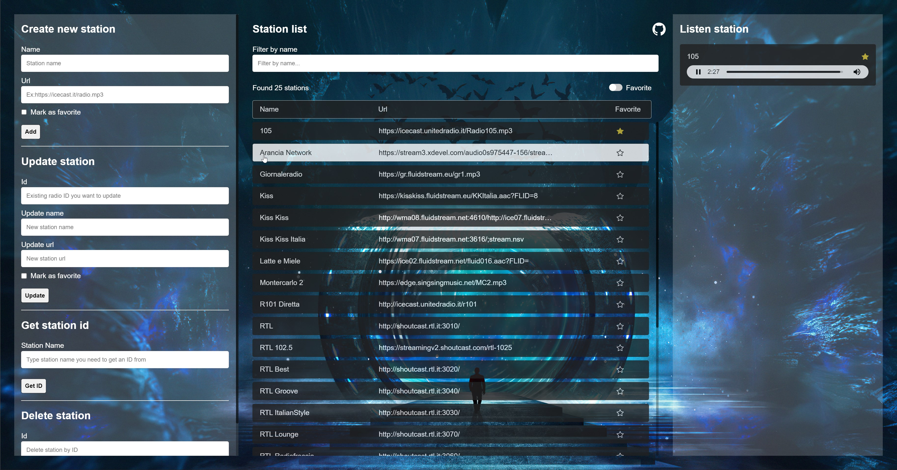

# pfcode-stations



## What is under the hood

A nodejs express server that store data in Sqlite3

## Functionality

- Register user
- Login user
- API endpoints
- Add new station
- Update existing station
- Delete existing station
- Filter stations
- Show favorite stations
- Listen station

## Run

```shell
npm i && nano .env
```

In the ```.env``` file add the following:

```shell
HOST=https://mywebsite.com
PORT=2345
COOKIE_SECRET=myCookieSecret
REGISTER_ENDPOINT_ENABLED=false
```

```shell
npm start
```

## Default login user

- Email: myname@myemail.com
- Password: -NJ"P}Il?bK/.^]5cHFk'+vp)DzV:%

## API Endpoints (protected, need to login)

- /api/users
- /api/session-data
- /api/stations
- /api/stations/fav

## Other endpoints

- /register (disabled by default, change it to true in the .env file then restart the server)
- /login
